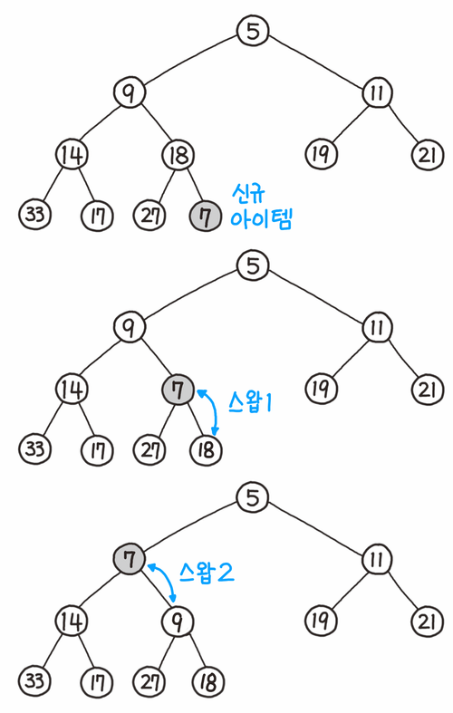

# 큐(Queue)
선입선출(先入先出, First In First Out; FIFO)의 자료구조. 대기열이라고도 한다. Queue라고도 하는데, Queue라는 단어 자체가 표 같은 것을 구매하기 위해 줄서는 것을 의미한다.

데이터가 들어오는 위치는 가장 뒤(Rear 또는 Back이라고 한다.)에 있고, 데이터가 나가는 위치는 가장 앞(Front라고 한다.)에 있어서, 먼저 들어오는 데이터가 먼저 나가게 된다. 우선순위 큐, 원형 큐 등의 베리에이션이 존재한다. 입력 동작은 Enqueue, 출력 동작은 Dequeue라고 한다.

- [백준 15828 - Router](https://github.com/hanbee1005/AlgorithmStudy/blob/master/BaekjoonAlgorithm/202211/Q15828.java)

### 원형 큐
배열을 지정해 놓고 큐를 쓰다보면 배열의 앞부분이 비게된다는 점을 활용해서 배열의 맨 마지막 부분을 쓰면 다시 제일 처음부터 다시 큐를 채우기 시작하는 형태의 큐이다. 원형 큐는 FIFO 구조를 지닌다는 점에서 기존의 큐와 동일하다. 그러나 마지막 위치가 시작 위치와 연결되는 원형구조를 띠기 때문에, 링 버퍼(Ring Buffer)라고도 부른다.          

동작하는 원리는 투 포인터와도 비슷하다. 마지막 위치와 시작 위치를 연결하는 원형 구조를 만들고, 요소의 시작점과 끝점을 따라 투 포인터가 움직인다. enQueue()를 하게 되면 rear 포인터가 앞으로 이동하고, deQueue()를 하게 되면 front 포인터가 앞으로 이동한다. 이렇게 enQueue()와 deQueue()를 반복하게 되면 서로 동그랗게 연결되어 있기 때문에 투 포인터가 빙글빙글 돌면서 이동하는 구조가 된다.

### 우선순위 큐
원소들에게 우선순위를 매겨서 넣을 때의 순서와 상관없이 뺄 때에는 우선순위가 높은 원소부터 빼내는 것이다. 대표적인 예로 heap이 있다.

**Heap Tree**          
여러 개의 값 중에서 가장 크거나 작은 값을 빠르게 찾기 위해 만든 이진 트리. 짧게 힙(Heap)이라고 줄여서 부르기도 한다.        

힙은 항상 완전 이진 트리의 형태를 띠어야 하고, 부모의 값은 항상 자식(들)의 값보다 크거나(Max heap 최대 힙), 작아야(Min heap 최소 힙)하는 규칙이 있다. 따라서 루트노드에는 항상 데이터들 중 가장 큰 값(혹은 가장 작은 값)이 저장되어 있기 때문에, 최댓값(혹은 최솟값)을 ***O(1)*** 안에 찾을 수 있다.

단순히 최댓값(최솟값)을 ***O(1)*** 안에 찾기 위해서라면 "항상 완전 이진 트리의 형태여야 한다"는 조건을 만족시킬 필요는 없다. 완전 이진 트리를 사용하는 이유는 삽입/삭제의 속도 때문이다.

- 데이터 삽입
  + 
  1. 가장 끝의 자리에 노드를 삽입한다.
  2. 그 노드와 부모 노드를 서로 비교한다.
  3. 규칙에 맞으면 그대로 두고, 그렇지 않으면 부모와 교환한다.
  4. 규칙에 맞을 때까지 3번 과정을 반복한다.
- 데이터 삭제
  + 
  최댓값 혹은 최솟값이 저장된 루트 노드만 제거할 수 있다.
  1. 루트 노드를 제거한다.
  2. 루트 자리에 가장 마지막 노드를 삽입한다.
  3. 올라간 노드와 그의 자식 노드(들)와 비교한다.
  4. 조건에 만족하면 그대로 두고, 그렇지 않으면 자식과 교환한다.
    + 최대 힙
      - 부모보다 더 큰 자식이 없으면 교환하지 않고 끝낸다.
      - 부모보다 더 큰 자식이 하나만 있으면 그 자식하고 교환하면 된다.
      - 부모보다 더 큰 자식이 둘 있으면 자식들 중 큰 값과 교환한다.
    + 최소 힙
      - 부모보다 더 작은 자식이 없으면 교환하지 않고 끝낸다.
      - 부모보다 더 작은 자식이 하나만 있으면 그 자식하고 교환하면 된다.
      - 부모보다 더 작은 자식이 둘 있으면 자식들 중 작은 값과 교환한다.
  5. 조건을 만족할 때까지 4의 과정을 반복한다.
- 표현
  + 
  + 이진 힙은 완전 이진 트리(Complete Binary Tree)로서, 배열로 표현하기 매우 좋은 구조다. 높이 순서대로 순회하면 모든 노드를 배열에 낭비 없이 배치할 수 있기 때문이다. 그림처럼 완전 이진 트리는 배열에 빈틈없이 배치가 가능하며, 대개 트리의 배열 표현의 경우 계산을 편하게 하기 위해 인덱스는 1부터 사용한다.
  + 해당 노드의 인덱스를 알면 깊이가 얼마인지, 부모와 자식 노드가 배열 어디에 위치하는지 바로 알아낼 수 있다. 깊이는 1, 2, 4, 8, ... 순으로 2배씩 증가하며, 인덱스는 1부터 시작했기 때문에 부모/자식 노드의 위치는 각각 부모 `(i - 1) / 2` , 왼쪽 자식 `i * 2`, 오른쪽 자식 `(i * 2) + 1`의 간단한 수식으로 계산할 수 있다. 이처럼 해당되는 배열의 인덱스를 금방 찾아낼 수 있다. 물론 꼭 완전 이진 형태가 아니어도 비어있는 위치는 얼마든지 널(Null)로 표현할 수 있기 때문에, 사실상 모든 트리는 배열로 표현이 가능하다.                    

- [백준 1927 - 최소 힙](https://github.com/hanbee1005/AlgorithmStudy/blob/master/BaekjoonAlgorithm/202210/Q1927.java)
- [백준 11279 - 최대 힙](https://github.com/hanbee1005/AlgorithmStudy/blob/master/BaekjoonAlgorithm/202210/Q11279.java)
- [백준 1655 - 가운데를 말해요](https://github.com/hanbee1005/AlgorithmStudy/blob/master/BaekjoonAlgorithm/202210/Q1655.java)

### Deque
일반적인 큐는 뒤에서만 삽입이 이루어지고 앞에서만 인출이 가능한 데 비해, 데크는 양쪽에서 모두 삽입/인출이 가능한 스택과 큐의 특징을 모두 갖고 있다. 이 추상 자료형(ADT)의 구현은 배열이나 연결 리스트 모두 가능하지만, 특히 이중 연결 리스트(Doubly Linked List)로 구현하는 편이 가장 잘 어울린다. 이중 연결 리스트로 구현하게 되면, 양쪽으로 head와 tail이라는 이름의 두 포인터를 갖고 있다가 새로운 아이템이 추가될 때마다 앞쪽 또는 뒤쪽으로 연결시켜 주기만 하면 된다. 당연히 연결 후에는 포인터를 이동하면 된다.

### Java PriorityQueue

### 실무에서 언제 사용?

### 참고
