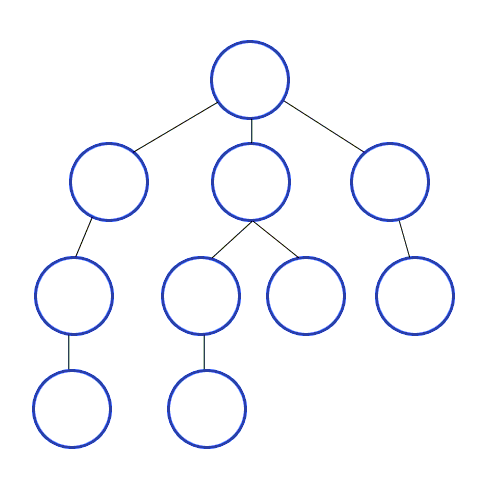

# Graph
- Graph는 vertices와 edge로 구성된 비선형 자료구조입니다.
- vertices는 종종 node라고 불리고 edge는 두 노드 사이를 연결하는 선을 의미합니다.
- 종류
	+ direction
		- edge가 양방향이면 Undirected graph
		- edge가 방향성이 있으면 Directed graph, 자기 자신에게 방향이 가면 self-loop
	+ cycle
		- 방향성을 가진 edge를 따라 돌다가 다시 처음 노드로 돌아가는 경우 Cycle
		- 다시 처음 지점으로 돌아오지 않으면 Acycle
	+ isolated
		- graph에서 고립된(다른 graph와 어떤 연결도 없는 또 다른) node or graph가 있는 경우 disconnected
		- 모든 노드가 1개 이상의 edge를 가지면 connected
		- 모든 노드가 다른 모든 노드들과 edge로 연결되어 있으면 completed

### BFS(Breadth First Search)
- 최대한 넓게 이동한 다음 더 이상 갈 수 없을 때 아래로 이동
- 루트 노드(혹은 다른 임의의 노드)에서 시작해서 인접한 노드를 먼저 탐색하는 방법으로, 시작 정점으로부터 가까운 정점을 먼저 방문하고 멀리 떨어져 있는 정점을 나중에 방문하는 순회 방법입니다.


- 최단 경로를 찾을 때 선택할 수 있습니다.
- 큐를 사용하여 구현 가능합니다.

```java
// 구현 코드
```

### DFS(Depth First Search)
- 최대한 깊게 이동한 다음 더 이상 갈 수 없을 때 옆으로 이동
- 루트 노드(혹은 다른 임의의 노드)에서 시작해서 다음 분기(branch)로 넘어가기 전에 **해당 분기를 완벽하게 탐색**하는 방식을 말합니다.


- 모든 노드를 방문하고자 하는 경우에 선택할 수 있습니다.
- BFS 보다 구현이 간단합니다.
- 검색 속도 자체는 BFS 보다 느립니다.
- 스택 또는 재귀 함수로 구현 가능합니다.

```java
// 구현 코드
```

#### 시간 복잡도
두 방식 모두 조건 내의 모든 노드를 검색한다는 점에서 시간 복잡도는 동일합니다.                     
DFS와 BFS 둘 다 다음 노드가 방문하였는지를 확인하는 시간과 각 노드를 방문하는 시간을 합하면 됩니다.

```
N은 노드, E는 간선일 때

- 인접 리스트 : O(N+E)
- 인접 행렬 : O(N²)

일반적으로 E(간선)의 크기가 N²에 비해 상대적으로 적기 때문에 인접 리스트 방식이 효율적입니다.
```

- 인접 행렬의 경우, 정점의 개수 N만큼 도는 이중 for문을 돌려 두 정점 간에 간선이 존재하는지를 확인해야 합니다. 이때 N의 제곱만큼 돌게 되므로 ```O(N²)```의 시간 복잡도가 됩니다.
- 인접 리스트로 구현된 경우, 존재하는 간선의 정보만 저장되어 있으므로 인접 행렬에서 사용한 이중 for문이 필요하지 않습니다. 다음 노드가 방문하였는지 확인할 때 간선의 개수인 E의 두 배만큼의 시간이 걸리고(1번에서 2, 6번이 방문하였는지를 확인하고 2번에서 1,3,6번을 방문하였는지 확인합니다. 이때 1번과 2번의 간선 하나에 두 번의 확인을 하기 때문에 두배만큼 시간이 걸립니다.) 각 노드를 방문할 때 정점의 개수인 N만큼 걸립니다. 따라서 ```O(N+2*E) = O(N+E)```가 됩니다. (시간 복잡도에서 계수는 삭제합니다.)

#### 문제 유형
1) 그래프의 **모든 정점**을 방문하는 것이 주요한 문제                   
단순히 모든 정점을 방문하는 것이 중요한 문제의 경우 ***DFS, BFS*** 두 가지 방법 중 어느 것을 사용하셔도 상관없습니다.
2) **경로의 특징**을 저장해둬야 하는 문제                  
예를 들면 각 정점에 숫자가 적혀있고 a부터 b까지 가는 경로를 구하는데 경로에 같은 숫자가 있으면 안 된다는 문제 등, 각각의 경로마다 특징을 저장해둬야 할 때는 ***DFS를 사용***합니다. (BFS는 경로의 특징을 가지지 못합니다)
3) **최단거리** 구해야 하는 문제                              
미로 찾기 등 최단거리를 구해야 할 경우, ***BFS가 유리***합니다. 왜냐하면 깊이 우선 탐색으로 경로를 검색할 경우 처음으로 발견되는 해답이 최단거리가 아닐 수 있지만, 너비 우선 탐색으로 현재 노드에서 가까운 곳부터 찾기 때문에경로를 탐색 시 먼저 찾아지는 해답이 곧 최단거리기 때문입니다.
                                 
	이밖에도 
	- 검색 대상 그래프가 정말 크다면 DFS를 고려
	- 검색대상의 규모가 크지 않고, 검색 시작 지점으로부터 원하는 대상이 별로 멀지 않다면 BFS

### 참고
- https://www.geeksforgeeks.org/graph-data-structure-and-algorithms/

### 연관 문제
- [Num. Title](https://github.com/hanbee1005/AlgorithmStudy/blob/master/Leetcode/202301)
