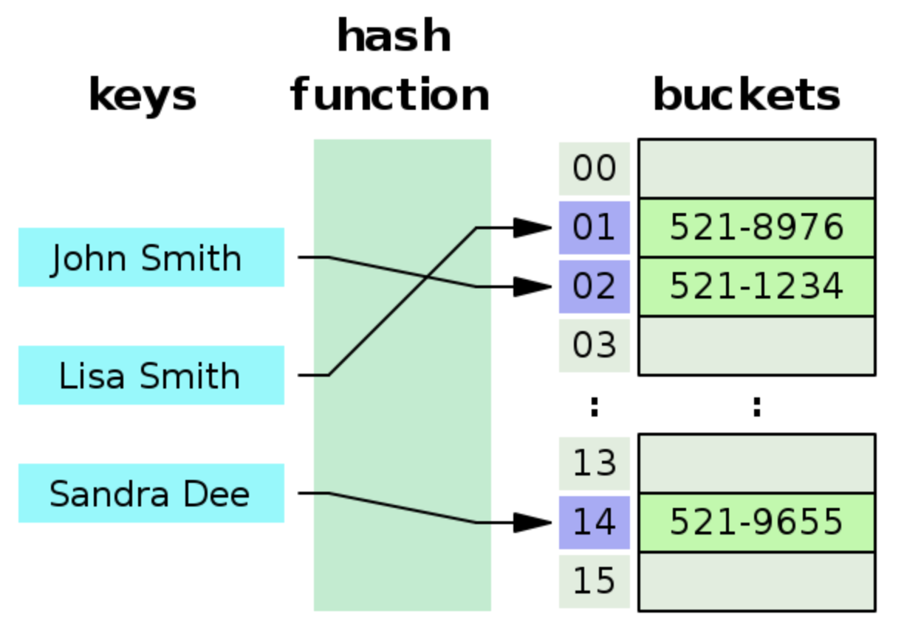
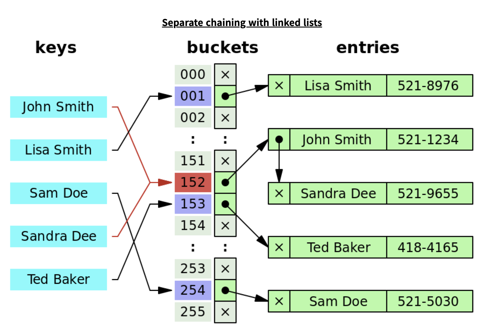

# HashMap
- 맵(Map)이라는 것은 키(key)와 값(value) 두 쌍으로 데이터를 보관하는 자료구조이고 키는 맵에 오직 유일하게 있어야 합니다. 값은 중복된 값이어도 상관 없습니다.
- 해시맵(HashMap)은 이름 그대로 해싱(Hashing)된 맵(Map)입니다.
- HashMap vs HashTable
	|                  |         HashMap         |            HashTable           |
	|:----------------:|:-----------------------:|:------------------------------:|
	|    Thread-safe   |            X            |                O               |
	|  key에 null 허용 |            X            |     O (null key 하나 허용)     |
	| Enumeration 허용 |            X            | not fail-fast Enumeration 제공 |
	|   Iterator type  |    Fail fast iterator   |       Fail safe iterator       |
	|  보조 해시 사용  | O (해시 충돌이 덜 발생) |                X               |
	|   중복 키 처리   | 뒤에 들어온 값으로 덮어쓰기 | 같은 키에 대해서는 처음 값을 유지  |
- 원리
	
	+ 자바에서 int hashCode()를 이용해서 배열에 값을 넣게 되는데 int 32비트 정수형으로 모든 해시 값을 담기에는 부족하기 때문에 ```int index = X.hashCode() % M;``` 과 같은 형태를 사용합니다.
	+ HashMap 초기 용량은 16이고 로드팩터 0.75로 75%가 차면 용량을 2배로 늘리는 작업이 일어납니다. 따라서 용량이 크게 필요한 경우에는 미리 초기 용량을 정하해주는 것이 좋습니다.
	+ 여기서 1/m 확률로 같은 공간을 사용하게 되는 **해시 출돌**이 발생할 수 있습니다.
		- 오픈 어드레싱(open addressing)
			+ 해시 충돌이 발생하면 근처 버킷에 자료를 저장하는 방식
			+ 충돌이 발생할 때마다 이미 저장된 데이터 삭제 및 근처 다른 버킷을 찾아야하며 검색 때에도 근처 버킷을 순회해야하는 단점이 있습니다.
		- 세퍼레이트 체이닝(separate chaining)
			+ 해시 충돌이 발생하면 같은 해시 값들을 링크드 리스트로 묶어서 관리하는 방식
			+ 자바 해시테이블, 해시맵에서 사용하는 방식입니다.
			

### 연관 문제
- [1. Two Sum](https://github.com/hanbee1005/AlgorithmStudy/blob/master/Leetcode/202301/TwoSum_1.java)
- [49. Group Anagrams](https://github.com/hanbee1005/AlgorithmStudy/blob/master/Leetcode/202301/GroupAnagrams_49.java)
- [349. Intersection of Two Arrays](https://github.com/hanbee1005/AlgorithmStudy/blob/master/Leetcode/202301/IntersectionOfTwoArrays_349.java)
- [929. Unique Email Addresses](https://github.com/hanbee1005/AlgorithmStudy/blob/master/Leetcode/202301/UniqueEmailAddresses_929.java)
- [387. First Unique Character in a String](https://github.com/hanbee1005/AlgorithmStudy/blob/master/Leetcode/202301/FirstUniqueCharacterInAString_387.java)
- [560. Subarray Sum Equals K](https://github.com/hanbee1005/AlgorithmStudy/blob/master/Leetcode/202301/SubarraySumEqualsK_560.java)