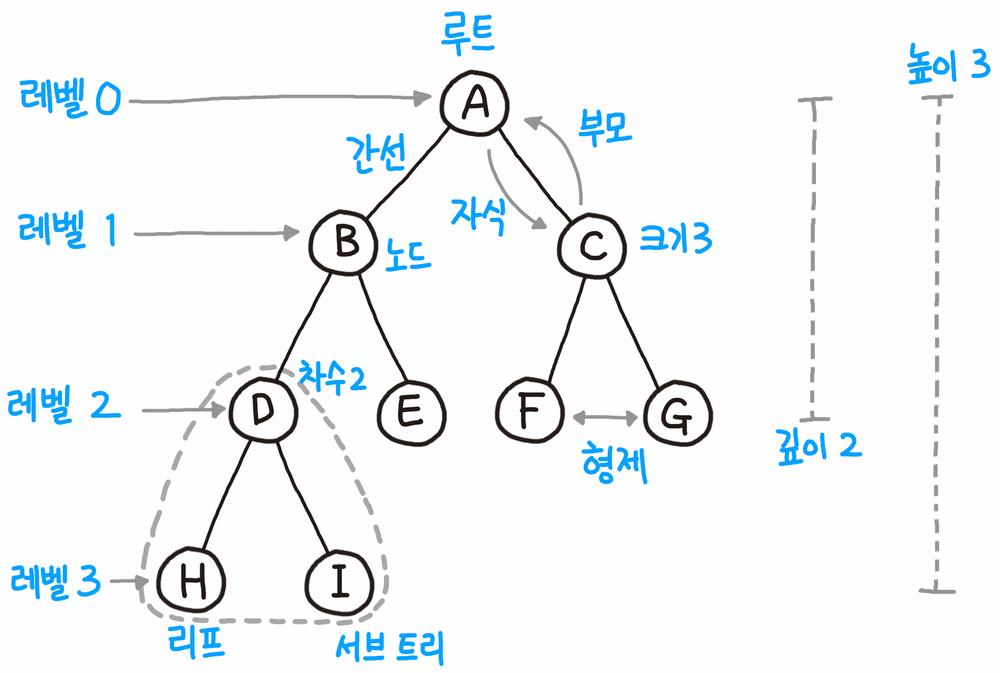

# Tree, BST
### Tree
- 노드들이 나무가지처럼 연결된 비선형 계층적 자료구조입니다.
- 특징
  + 하나의 루트 노드와 0개 이상의 하위 트리로 구성되어 있습니다.
  + 데이터를 순차적으로 저장하지 않기 때문에 비선형 자료구조입니다.
  + 트리내에 또 다른 트리가 있는 재귀적 자료구조입니다.
  + 단순 순환(Loop)을 갖지 않고, 연결된 무방향 그래프 구조입니다.
  + 노드 간에 부모 자식 관계를 갖고 있는 계층형 자료구조이며 모든 자식 노드는 하나의 부모 노드만 갖습니다.
  + 노드가 n개인 트리는 항상 n-1개의 간선(edge)을 가집니다.
- 종류
  + 정 이진 트리(full binary tree): 모든 트리의 자식은 0개나 2개입니다.
  + 포화 이진 트리(perfect binary tree): 모든 리프 노드의 높이가 같고 리프 노드가 아닌 노드는 모두 2개의 자식을 가집니다. 이진 트리에서 리프 높이의 최대치가 n일 때 가장 많이 존재할 수 있는 노드의 수는 ```2^n - 1```개인데 포화 이진 트리는 이 개수를 모두 채운 이진 트리라고도 볼 수 있습니다. 또한, 모든 포화 이진 트리는 정 이진 트리입니다.
  + 완전 이진 트리(complete binary tree): 모든 리프노드의 높이가 최대 1 차이가 나고, 모든 노드의 오른쪽 자식이 있으면 왼쪽 자식이 있는 이진트리입니다. 다시 말해 트리의 원소를 왼쪽에서 오른쪽으로 하나씩 빠짐없이 채워나간 형태입니다. 포화 이진 트리는 완전 이진 트리의 부분집합이지만 포화 이진 트리가 아닌 완전 이진 트리는 정 이진 트리일 수도 있고 아닐 수도 있다.


### BST(Binary Search Tree)
- 이진 트리의 일종으로, 노드의 왼쪽 가지에는 노드의 값보다 작은 값들만 있고, 오른쪽 가지에는 큰 값들만 있도록 구성되어 있습니다.
- 이렇게 구성해 두면 어떤 값 ```n```을 찾을 때, 루트 노드와 비교해서 ```n```이 더 작다면 루트 노드보다 큰 값들만 모여 있는 오른쪽 가지는 전혀 탐색할 필요가 없습니다. 마찬가지로 루트 노드의 왼쪽 자식보다 ```n```이 크다면 왼쪽 자식의 왼쪽 가지는 탐색할 필요가 없어서 트리 자체가 이진 탐색을 하기에 적합한 구성입니다. 또한 값을 찾을 때뿐만이 아니라 값을 삽입하거나 삭제할 때도 똑같은 과정을 거치므로, 이상적인 상황에서 탐색/삽입/삭제 모두 시간복잡도가 ```O(logN)```이 됩니다.

### 참고
- https://namu.wiki/w/%ED%8A%B8%EB%A6%AC(%EA%B7%B8%EB%9E%98%ED%94%84)

### 연관 문제
- [104. Maximum Depth of Binary Tree](https://github.com/hanbee1005/AlgorithmStudy/blob/master/Leetcode/202302/MaximumDepthOfBinaryTree_104.java)
- [111. Minimum Depth of Binary Tree](https://github.com/hanbee1005/AlgorithmStudy/blob/master/Leetcode/202302/MinimumDepthOfBinaryTree_111.java)
- [617. Merge Two Binary Trees](https://github.com/hanbee1005/AlgorithmStudy/blob/master/Leetcode/202302/MergeTwoBinaryTrees_617.java)
- [108. Convert Sorted Array to Binary Search Tree](https://github.com/hanbee1005/AlgorithmStudy/blob/master/Leetcode/202302/ConvertSortedArrayToBinarySearchTree_108.java)
- [112. Path Sum](https://github.com/hanbee1005/AlgorithmStudy/blob/master/Leetcode/202302/PathSum_112.java)
- [102. Binary Tree Level Order Traversal](https://github.com/hanbee1005/AlgorithmStudy/blob/master/Leetcode/202302/BinaryTreeLevelOrderTraversal_102.java)
- [103. Binary Tree ZigZag Level Order Traversal](https://github.com/hanbee1005/AlgorithmStudy/blob/master/Leetcode/202302/BinaryTreeZigzagLevelOrderTraversal_103.java)