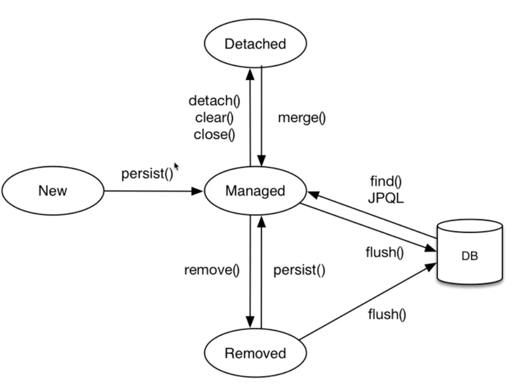
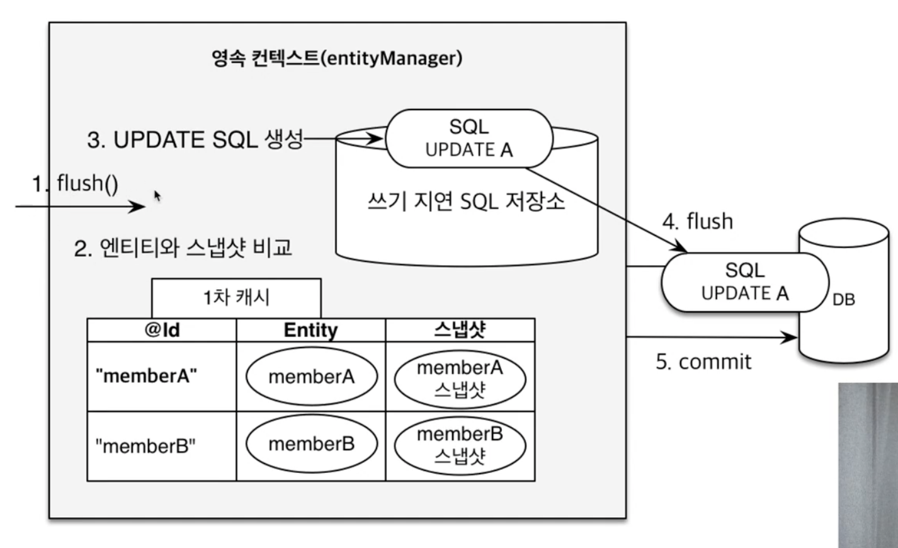

# JPA란?

## 영속성 관리
### 영속성 컨텍스트
- **엔티티를 영구 저장하는 환경**
- Entity Manager Factory
    + 고객의 요청이 올때마다 Entity Manager를 생성
- Entity Manager
    + DB connection을 사용해서 DB 접근
- 영속성 컨텍스트는 논리적인 개념이고 눈에 보이지 않지만 Entity Manager를 통해서 접근

### 생명 주기
- 비영속 (new/transient)
    + 영속성 컨텍스트와 전혀 관계가 없는 새로운 상태
- 영속 (managed)
    + 영속성 컨텍스트에 관리되는 상태
- 준영속 (detached)
    + 영속성 컨텍스트에 저장되었다가 분리된 상태
- 삭제 (removed)
    + 삭제된 상태


### 이점
- 1차 캐시
  + 조회 시 1차 캐시를 먼저 조회하고 없는 경우 DB 에서 조회해서 캐시에 저장하고 반환
  ```java
  // 비영속
  Member member = new Member();
  member.setId(100L);
  member.setName("helloJPA");

  // 영속 (1차 캐시에 저장됨)
  em.persist(member);

  // 1차 캐시에서 조회 (select 쿼리 x)
  Member findMember = em.find(Member.class, 100L);
  ```
- 동일성 (identity) 보장
  + 1차 캐시로 반복 가능한 읽기(REPEATABLE READ) 등급의 트랜잭션 격리 수준을 데이터베이스가 아닌 애플리케이션 차원에서 제공
  ```java
  Member member1 = em.find(Member.class, 100L);
  Member member2 = em.find(Member.class, 100L);

  System.out.println(member1 == member2); // 동일성 비교 true
  ```
- 트랜잭션을 지원하는 쓰기 지연 (transactional write-behind)
  ```java
  EntityManager em = emf.createEntityManager();
  EntityTransaction tx = em.getTransaction();
  // 엔티티 매니저는 데이터 변경 시 트랜잭션을 시작해야 한다.
  tx.begin();  // 트랜잭션 시작

  em.persist(member1);
  em.persist(member2);
  // 여기까지 INSERT SQL을 데이터베이스에 보내지 않는다.

  // 커밋하는 순간 데이터베이스에 INSERT SQL을 보낸다.
  tx.commit();  // 트랜잭션 커밋
  ```
- 변경 감지 (Dirty Checking)
  ```java
  EntityManager em = emf.createEntityManager();
  EntityTransaction tx = em.getTransaction();
  tx.begin();  // 트랜잭션 시작

  // 영속 엔티티 조회
  Member member = em.find(Member.class, 100L);

  // 영속 엔티티 데이터 수정
  member.setName("SpringJPA");

  // em.update(member) 이런 코드가 없어도
  tx.commit();  // 트랜잭션 커밋할 때 변경 사항 확인하고 쿼리 실행
  ```
  
- 지연 로딩 (Lazy Loading)

### 더보기
- 플러시 (flush)
  + 영속성 컨텍스트의 변경 내용을 데이터베이스에 반영 (1차 캐시가 지워지는 것이 아님!)
  + 변경 감지 → 수정된 엔티티 쓰기 지연 SQL 저장소에 등록 → 쓰기 지연 SQL 저장소의 쿼리를 데이터베이스에 전송 (등록, 수정, 삭제 쿼리)
  + 플러시 하는 방법
    - `em.flush();` - 직접 호출
    - 트랜잭션 커밋 - 플러시 자동 호출
    - JPQL 쿼리 실행 - 플러시 자동 호출
  + 플러시 모드
    - `em.setFlushMode(FlushModeType.COMMIT)`
    - `FlushModeType.AUTO` - 커밋이나 쿼리를 실행할 때 (기본값)
    - `FlushModeType.COMMIT` - 커밋할때만
- 준영속 상태
    + 영속상태가 되는 경우
        - em.persist() 로 저장하는 경우
        - em.find() 등 JPA 조회를 했을 때 영속성 컨텍스트에 없으면 1차 캐시에 저장하면 영속 상태가 됨
    + 영속 상태의 엔티티가 영속성 컨텍스트에서 분리(detached)
    + 영속성 컨텍스트가 제공하는 기능을 사용 못함
    + 준영속 상태로 만드는 방법
        - em.detach(entity) : 특정 엔티티만 준영속 상태로 전환
        - em.clear() : 영속성 컨텍스트를 완전히 초기화 (1차 캐시 모두 날림)
        - em.close() : 영속성 컨텍스트를 종료
