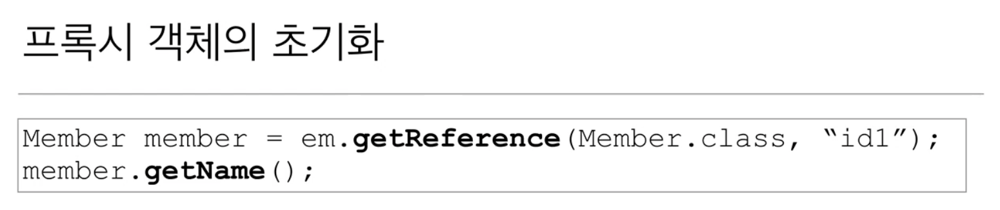
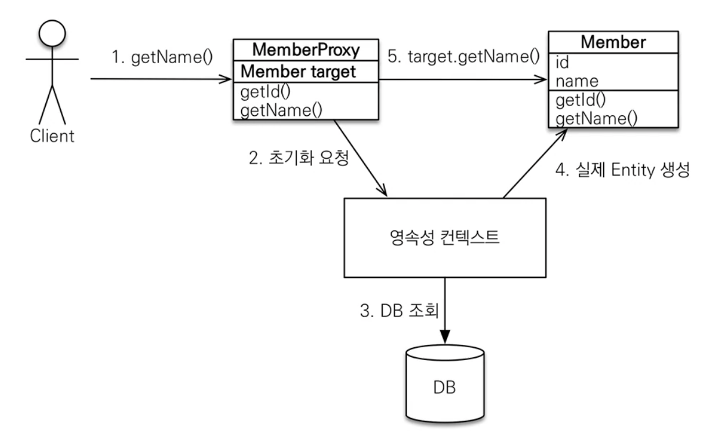

# 프록시

- 프록시 기초
  - em.find() : 데이터베이스를 통해 실제 엔티티 조회
  - em.getReference() : 데이터베이스 조회를 미루는 가짜(프록시) 엔티티 객체 조회
- 프록시 특징
  - 실제 엔티티를 상속받아서 만들어짐
  - 실제 클래스와 겉모습은 동일
  - 사용하는 입장에서는 진짜 객체인지 프록시 객체인지 구분하지 않고 사용하면 됨 (이론상)
  - 프록시 객체는 실제 객체의 참조(target)을 보관
  - 프록시 객체를 호출하면 프록시 객체는 실제 객체의 메소드 호출
  
  
  
  - 프록시 객체는 처음 사용할 때 한번만 초기화
  - 프록시 객체를 초기화할 때, 프록시 객체가 실제 엔티티로 바뀌는 것은 아님. 초기화되면 프록시 객체를 통해 실제 엔티티에 접근 가능
  - 프록시 객체는 원본 엔티티를 상속 받음. 따라서 타입 체크 시 주의해야 함 (== 비교 실패, 대신 instance of 사용)
  - 영속성 컨텍스트에 찾는 엔티티가 이미 있으면 em.getReference() 를 호출해도 실제 엔티티 반환

      → 이미 1차 캐시되어 있기 때문에 프록시로 반환할 이유가 없기도 하고 한 트랜잭션 내에서 같은 객체에 pk도 같은 것은 == 비교시 반드시 true가 되어야 함.

      → find() 후 getReference() 하면 둘다 그냥 객체, getReference() 후 find() 하면 둘다 프록시 객체

  - 영속성 컨텍스트의 도움을 받을 수 없는 준영속 상태일 때, 프록시를 초기화하면 문제 발생 (하이버네이트는 org.hibernate.LazyInitializationException 예외를 발생)
- 프록시 확인
  - 프록시 인스턴스의 초기화 여부 확인 → `PersistenceUnitUtil.isLoaded(Object entity)`
  - 프록시 클래스 확인 → `entity.getClass().getName()`
  - 프록시 강제 초기화 → `org.hibernate.Hibernate.initialize(entity)`
      - JPA 표준은 강제 초기화가 없고 entity 내부 필드 사용시 초기화 (`member.getName()` 등)

# 즉시 로딩과 지연 로딩

- 지연 로딩(LAZY)을 사용해서 프록시로 조회
    
    ```java
    @Entity
    public class Member {
    	...
    	@ManyToOne(fetch = FetchType.LAZY)
    	@JoinColumn(name = "team_id")
    	private Team team;
    	...
    }
    ```
    
- 즉시 로딩(EAGER)를 사용해서 함께 조회
- 주의
    - 가급적 **지연 로딩만 사용** (특히 실무에서)
    - 즉시 로딩을 적용하면 예상치 못한 SQL이 발생
    - 즉시 로딩은 JPQL에서 N+1 문제 발생
        - JPQL이 SQL로 번역되면서 그대로 객체를 가져온 뒤 연관된 데이터를 가져오기 위해 SQL이 별도로 반복돼서 나감
        - 해결은 모두 지연 로딩으로 설정한 뒤 JPQL의 fetch 조인, 엔티티 그래프 사용
    - `@ManyToOne`, `@OneToOne`은 기본이 즉시 로딩 → LAZY로 설정
    - `@OneToMany`, `@ManyToMany`는 기본이 지연 로딩

# 영속성 전이(CASCADE)와 고아 객체

- 특정 엔티티를 영속 상태로 만들 때 연관된 엔티티도 함께 영속 상태로 만들고 싶을 때
- 연관관계 매핑이랑 아무 관련이 없음
- 엔티티를 영속화할 때 연관된 엔티티도 함께 영속화하는 편리함을 제공할 뿐
- 종류
    - **ALL : 모두 적용**
    - **PERSIST : 영속** (저장할 때만 맞춤)
    - REMOVE : 삭제
    - MERGE : 병합
    - REFRESH
    - DETACH
- 하나의 부모가 자식들을 관리할 때 의미가 있음. 소유자가 하나일 때 사용. (게시판, 첨부파일 등)
- 부모와 자식의 라이프 사이클이 유사할 때, 단일 소유자일 때 사용!
- 고아 객체
    - 고아 객체 제거 : 부모 엔티티와 연관관계가 끊어진 자식 엔티티를 자동으로 삭제
    - ophanRemoval = true
    
    ```java
    Parent p1 = em.find(Parent.class, id);
    p1.getChildren().remove(0);  // 자식 엔티티를 컬렉션에서 제거
    ```
    
    - DELETE FROM child WHERE id = ?
    - 주의
        - 참조가 제거된 엔티티는 다른 곳에서 참조하지 않는 고아 객체로 보고 삭제하는 기능
        - 참조하는 곳이 하나일 때 사용해야 함
        - 특정 엔티티가 개인 소유할 때 사용
        - @OneToOne, @OneToMany에서만 가능
        - 개념적으로 부모를 제거하면 자식은 고아가 된다. 따라서 고아 객체 제거 기능을 활성화 하면 부모를 제거할 때 자식도 함께 제거된다. 이것은 CascadeType.REMOVE 처럼 동작한다.
- 영속성 전이 + 고아 객체, 생명 주기
    - CascadeType.ALL + OphanRemoval = true
    - 스스로 생명 주기를 관리하는 엔티티는 em.persist()로 영속화, em.remove()로 제거
    - 두 옵션을 모두 활성화하면 부모 엔티티를 통해서 자식의 생명 주기를 관리할 수 있음
    - 도메인 주도 설계 (DDD)의 Aggregate Root 개념을 구현할 때 유용
